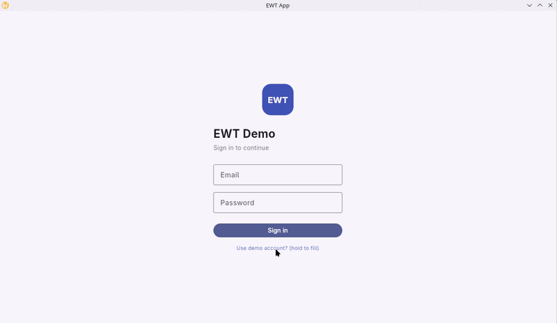
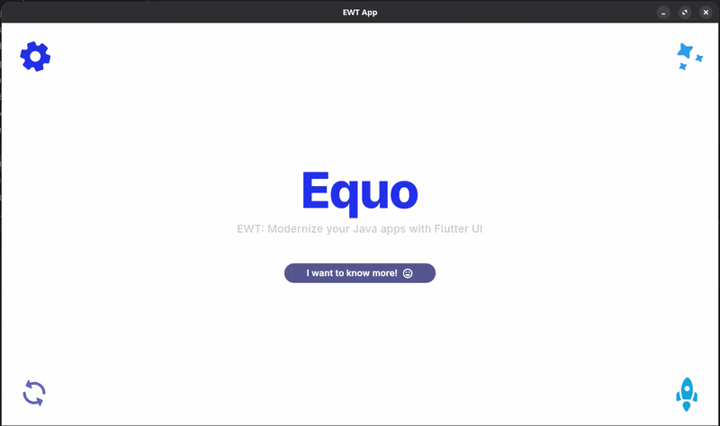

# EWT — Equo Widget Toolkit


  

**Build modern desktop UIs on the JVM.**

EWT lets JVM developers create native, cross-platform desktop user interfaces —
in Java, Kotlin, or any JVM language, with no Dart required. You get modern,
fluid interfaces using the languages, tools, and IDE you already work with.

<p align="center">
  
</p>

```java
import dev.equo.ewt.*;
import static dev.equo.ewt.EWT.*;

public class HelloWorld {
    public static void main(String[] args) {
        App.runApp(() ->
            Center().child(Text("hello from Java"))
        );
    }
}
```

---

## Why EWT

- **One codebase, every desktop platform** — run the same UI on Linux, macOS,
  and Windows.
- **Any JVM language** — write your UI in Java, Kotlin, or any language that runs
  on the JVM.
- **Modern, fluid interfaces** — smooth, GPU-accelerated rendering with crisp
  fonts and sharp icons.
- **A fluent, type-safe API** — compose your UI from familiar building blocks
  like `Center`, `Column`, `Container`, `Scaffold`, and `MaterialApp`.
- **Reactive by design** — build dynamic UIs that update automatically as your
  data changes.

## Example: an interactive counter

This counter rebuilds its UI every time the button is tapped:

```java
class Counter extends SubStatefulWidget {
    @Override
    protected State<Counter> createState() { return new CounterState(); }
}

class CounterState extends SubState<Counter> {
    int count = 0;

    @Override
    public Widget build(BuildContext ctx) {
        return Scaffold()
            .body(Center().child(Text("Count: " + count)))
            .floatingActionButton(
                FloatingActionButton()
                    .onPressed(() -> setState(() -> count++))
                    .child(Icon(Icons.add()))
            );
    }
}
```

Beyond static layouts, EWT supports rich animations for polished, modern UIs:

<p align="center">
  
</p>

## Requirements

- **JDK 22 or newer**

## Getting started

You don't clone this repository to build an app with EWT — add the published
artifact to your own Gradle or Maven project.

EWT ships as platform-specific JARs, so pick the classifier for your target
platform: `linux`, `macos`, or `windows`.

### Gradle (Kotlin DSL)

```kotlin
repositories {
    maven { url = uri("https://gitlab.com/api/v4/projects/67882950/packages/maven") }
}

val ewtOs = when {
    org.gradle.internal.os.OperatingSystem.current().isWindows -> "windows"
    org.gradle.internal.os.OperatingSystem.current().isMacOsX  -> "macos"
    else                                                       -> "linux"
}

dependencies {
    // `+` pulls the latest release; pin a version (e.g. 0.1.0) for reproducible builds
    implementation("dev.equo:ewt.api:+:$ewtOs@jar")
}
```

### Maven

```xml
<repositories>
  <repository>
    <id>ewt</id>
    <url>https://gitlab.com/api/v4/projects/67882950/packages/maven</url>
  </repository>
</repositories>

<dependencies>
  <dependency>
    <groupId>dev.equo</groupId>
    <artifactId>ewt.api</artifactId>
    <version>0.1.0</version>
    <classifier>linux</classifier> <!-- or macos / windows -->
  </dependency>
</dependencies>
```

Then write your UI (see the example above) and start it with `App.runApp(...)`.
EWT calls into native code, so run your app with
`--enable-native-access=ALL-UNNAMED` (and `-XstartOnFirstThread` on macOS).

### Explore the examples

To browse the bundled sample apps, clone the repo and run one directly:

```bash
./gradlew :examples:run -PmainClass=dev.equo.WidgetGallery
```

Switch `mainClass` to try others — `dev.equo.Demo`,
`dev.equo.AnimationWidgetsDemo`, `dev.equo.MusicPlayer`,
`dev.equo.AnalyticsDashboard`, `dev.equo.Calculator`, and more in
[`examples/`](examples/src/main/java/dev/equo).

## Roadmap

EWT is under active, fast-moving development. Here's where we're headed:

**Coming soon**

- **Web support** — run the same EWT codebase in the browser. One UI, desktop and
  web, no rewrite.
- **Animations** — a full `AnimationController` API for building fluid, animated
  interfaces.
- **Complete widget coverage** — full support for Flutter's entire Material and
  foundational widget sets, plus Cupertino (iOS-style) components, so you can
  build in whatever design language your product needs.

**On the horizon**

- **[SWT Evolve](https://equo.dev/swt) integration** — drop brand-new EWT
  components straight into modernized SWT / Eclipse RCP applications, mixing fresh
  EWT screens with your existing UI in the same window — feature by feature, at
  your pace.

## License

EWT is licensed under the [Apache License 2.0](LICENSE). It is permissive and
patent-protective, and integrates cleanly with Eclipse RCP (EPL 2.0) and other
commercial or open-source software.

## Enterprise & Commercial Support

EWT is an open-source project, and we are committed to its growth and success.

For organizations building production applications, **Equo** offers commercial
products and professional services to accelerate your work and ensure project
success. Our offerings include:

- **Custom Widget Development** — bespoke UI components tailored to your specific
  business needs.
- **Theming & Custom Branding** — full visual customization to align the UI with
  your company's style guidelines.
- **Application Development Services** — let our team help you design and build
  your Java UI on EWT.
- **Equo SDK** — middleware and developer tools to build secure, efficient, and
  scalable Java applications.
- **Equo Chromium** — integrate a high-performance, modern Chromium-based browser
  directly into your Java app.
- **Signed & Notarized Binaries** — deploy with confidence using production-ready,
  signed binaries for all major platforms, including macOS notarization.
- **Dedicated Enterprise Support** — priority support channels, expert training,
  and defined SLAs for your mission-critical applications.

Ready to take your project to the next level? Contact our team at
**support@equo.dev** to learn more about Equo Enterprise.
