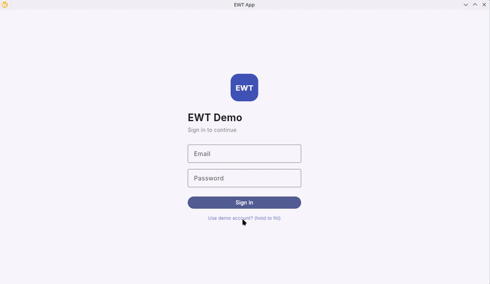
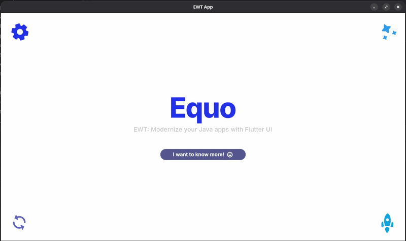
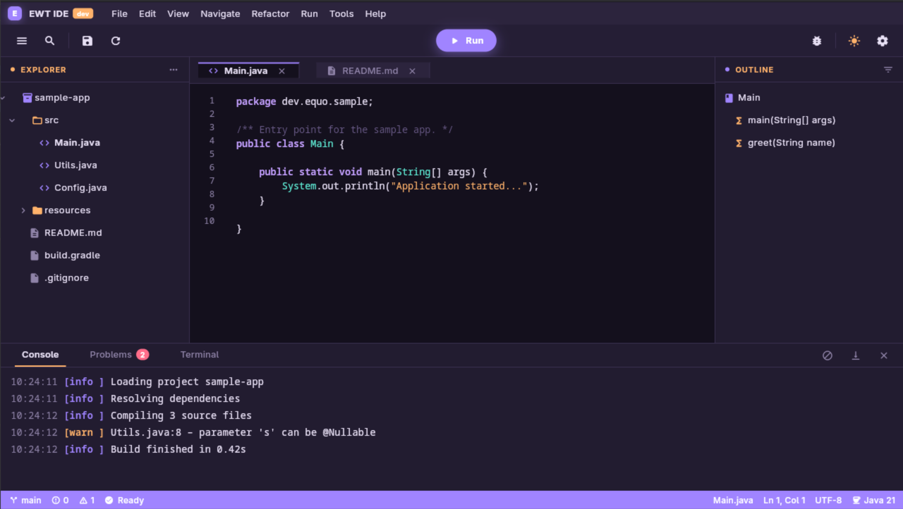
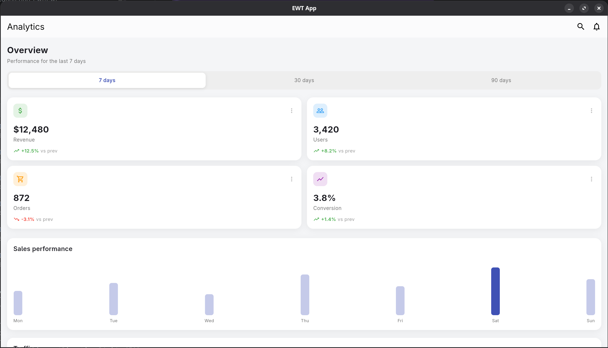

# EWT — Equo Widget Toolkit


  

**A modern desktop UI toolkit for the JVM.**

EWT lets you build native desktop applications entirely in Java (or any
JVM language) with a fluid, GPU-accelerated front-end. You compose your UI from
a fluent, type-safe widget API, run it natively on Linux, macOS, and Windows
from a single codebase, and get reactive rendering that updates automatically
as your data changes.

<p align="center">
  
</p>

```java
import dev.equo.ewt.*;
import static dev.equo.ewt.EWT.*;

public class HelloWorld {
    public static void main(String[] args) {
        App.runApp(() ->
            Center().child(Text("hello from Java"))
        );
    }
}
```

---

## Why EWT

- **Pure Java stack** — write, debug, and ship your entire UI in Java (or any
  JVM language) using the tools and IDE you already use.
- **One codebase, every desktop platform** — the same UI runs on Linux, macOS,
  and Windows.
- **Fluid, GPU-accelerated rendering** — smooth animations, crisp fonts, sharp
  icons, and a contemporary look out of the box.
- **Reactive by design** — build dynamic UIs that update automatically as your
  data changes.

## Works with SWT Evolve

[SWT Evolve](https://www.equo.dev/swt) is a separate Equo product that
modernizes existing SWT and Eclipse RCP applications, keeping their current UI
functional as it is.

EWT integrates with SWT Evolve, so an SWT/RCP application running on Evolve can
host EWT-built views inside the same window as its existing SWT widgets. Where
Evolve refreshes and preserves the SWT surface teams already have, EWT brings
capabilities the SWT widget set simply doesn't offer: a full modern widget
vocabulary (Scaffold, Material and — coming soon — Cupertino components), fluid
GPU-accelerated rendering, rich animations, and a reactive rendering model that
updates the UI automatically as your data changes.

The result: teams on Evolve keep the SWT/RCP application they already ship,
and reach for EWT whenever they need to build new screens that go beyond what
SWT can express — without adopting a second UI stack outside the JVM.

## Example: an interactive counter

This counter rebuilds its UI every time the button is tapped:

```java
class Counter extends SubStatefulWidget {
    @Override
    protected State<Counter> createState() { return new CounterState(); }
}

class CounterState extends SubState<Counter> {
    int count = 0;

    @Override
    public Widget build(BuildContext ctx) {
        return Scaffold()
            .body(Center().child(Text("Count: " + count)))
            .floatingActionButton(
                FloatingActionButton()
                    .onPressed(() -> setState(() -> count++))
                    .child(Icon(Icons.add()))
            );
    }
}
```

Beyond static layouts, EWT supports rich animations for polished, modern UIs:

<p align="center">
  
</p>

## Requirements

- **JDK 22 or newer**

## Getting started

Add EWT to your Gradle or Maven project. EWT ships as platform-specific JARs,
so pick the classifier for your target platform: `linux`, `macos`, or `windows`.
The current release is **`0.1.4`**.

### Gradle (Kotlin DSL)

```kotlin
repositories {
    maven(url = "https://gitlab.com/api/v4/projects/67882950/packages/maven")
}

val ewtOs = when {
    org.gradle.internal.os.OperatingSystem.current().isWindows -> "windows"
    org.gradle.internal.os.OperatingSystem.current().isMacOsX  -> "macos"
    else                                                       -> "linux"
}

dependencies {
    implementation("dev.equo:ewt.api:0.1.4:$ewtOs@jar")
}
```

### Maven

```xml
<repositories>
  <repository>
    <id>equo</id>
    <url>https://gitlab.com/api/v4/projects/67882950/packages/maven</url>
  </repository>
</repositories>

<dependencies>
  <dependency>
    <groupId>dev.equo</groupId>
    <artifactId>ewt.api</artifactId>
    <version>0.1.4</version>
    <classifier>linux</classifier> <!-- or macos / windows -->
  </dependency>
</dependencies>
```

### JAR Files

- Linux: https://dl.equo.dev/ewt/ewt.api/latest/ewt.api-latest-linux.jar
- macOS: https://dl.equo.dev/ewt/ewt.api/latest/ewt.api-latest-macos.jar
- Windows: https://dl.equo.dev/ewt/ewt.api/latest/ewt.api-latest-windows.jar

Then write your UI (see the Counter example above) and start it with
`App.runApp(...)`.

## What you can build

The possibilities are endless — here are a few visual samples of what you can
build with EWT:

<p align="center">
  <br>
  <sub><em>An IDE-style layout with panels, tabs and a code editor — built entirely in Java on EWT.</em></sub>
</p>

<p align="center">
  <br>
  <sub><em>A data-dense analytics dashboard with charts and KPI cards, rendered natively via EWT.</em></sub>
</p>

To browse the bundled sample apps, clone the repo and run one directly:

```bash
./gradlew :examples:run -PmainClass=dev.equo.WidgetGallery
```

Switch `mainClass` to try others — `dev.equo.Demo`,
`dev.equo.AnimationWidgetsDemo`, `dev.equo.MusicPlayer`,
`dev.equo.AnalyticsDashboard`, `dev.equo.Calculator`, and more in
[`examples/`](examples/src/main/java/dev/equo).

## Hot-Reload (Experimental, MVP)

In any EWT consumer module, apply the plugin:

```kotlin
plugins {
    application
    id("dev.equo.ewt.hot-reload")
}

application {
    mainClass = "com.mycompany.MyApp"
}
```

Run with hot-reload enabled:

```bash
./gradlew hotRun
```

Edit any `.java` under the module's `src/main/java`. On save, the client:
1. Recompiles via `./gradlew :<module>:classes` (module is auto-discovered).
2. Redefines the bytecode in the running JVM through JDWP (`localhost:5005`).
3. Triggers `WidgetsBinding.reassembleApplication()` on the Dart side (over `localhost:5006`).

**MVP limitations:**
- Method-body changes only. Signature changes, new fields, or new classes require a restart.
- State is not preserved (counters reset to 0). This is a consequence of the `UniqueKey` used by `SubStatefulWidget`.
- Debug port is bound to `localhost:5005` only. Do not expose to public interfaces; avoid containerized images that expose it without changes.

**Troubleshooting:**
- `Address already in use` on startup means a previous run left the JDWP port bound. Kill leftover JVMs and stop the Gradle daemon:
  ```bash
  lsof -ti:5005 | xargs -r kill -9
  lsof -ti:5006 | xargs -r kill -9
  ./gradlew --stop
  ```
- If the client logs `<class> not loaded yet in target VM, skipping.` for every changed class, JDWP is attached to the wrong JVM. Ensure you are launching through the `hotRun` task, not by manually setting `org.gradle.jvmargs`.

## Roadmap

EWT is under active, fast-moving development. Here's where we're headed:

**Coming soon**

- **Web support** — run the same EWT codebase in the browser. One UI, desktop
  and web, no rewrite.

**On the horizon**

- **Expanded widget coverage** — a broader Material widget set plus Cupertino
  (iOS-style) components, so you can build in whatever design language your
  product needs.

## License

EWT is licensed under the [Apache License 2.0](LICENSE). It is permissive and
patent-protective, and integrates cleanly with Eclipse RCP (EPL 2.0) and other
commercial or open-source software.

## Enterprise & Commercial Support

EWT is an open-source project, and we are committed to its growth and success.

For organizations building production applications, **Equo** offers commercial
products and professional services to accelerate your work and ensure project
success. Our offerings include:

- **Custom Widget Development** — bespoke UI components tailored to your specific
  business needs.
- **Theming & Custom Branding** — full visual customization to align the UI with
  your company's style guidelines.
- **Application Development Services** — let our team help you design and build
  your Java UI on EWT.
- **Equo SDK** — middleware and developer tools to build secure, efficient, and
  scalable Java applications.
- **Equo Chromium** — integrate a high-performance, modern Chromium-based browser
  directly into your Java app.
- **Signed & Notarized Binaries** — deploy with confidence using production-ready,
  signed binaries for all major platforms, including macOS notarization.
- **Dedicated Enterprise Support** — priority support channels, expert training,
  and defined SLAs for your mission-critical applications.

Ready to take your project to the next level? Contact our team at
**support@equo.dev** to learn more about Equo Enterprise.
